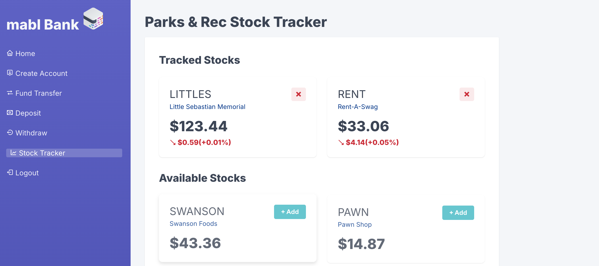

# Banking App in ReactJS



The user is a bank employee who manually manages the bank's accounts.
He does the creation of account manually using the account holders name and sets the initial balance of the account if possible.

He also does the withdrawal and deposit manually for each account.
He also does the transfer of balances if there are requests for it.
Your task is to help this poor employee out by creating a simple admin banking app

[Live demo of Banking App](https://jeffdelara.github.io/banking-app/)

## Objective
A banking app created with ReactJS that we can test with both mabl and playwright. Included is a shell script
that will run tests with both platforms twice.  Initially we will run the tests against the original state of 
the application.  The script will then apply a UI change to our login button as one might expect changes to occur
in typical dev cycles.  We will then re-run the tests in both mabl and playwright and as expected the playwright
test will fail while mabl will pass.  Once completed the application state will be restored to the original version 
using git stash.

Since this test will be running again your local environment you'll want to deploy the mabl link agent, and configure
your local host as a dev environment in your workspace.  Additionally within the demo-auto-healing.sh you'll need to
replace the api key with your own cli auth key.

## To start the dev server
NODE_OPTIONS=--openssl-legacy-provider npm start

## To run the demo script 
sh demo-auto-healing.sh

## Demo Account Credentials

Use the following credentials to test the app.

### For Admin
```
email: admin@admin.com
password: abc123
```

### For Client
```
email: client@client.com
password: abc123
```

[Live demo of Banking App](https://jeffdelara.github.io/banking-app/)
